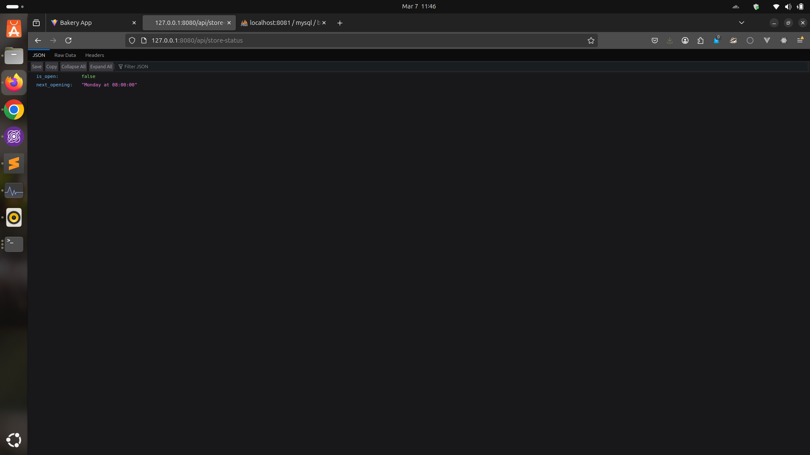
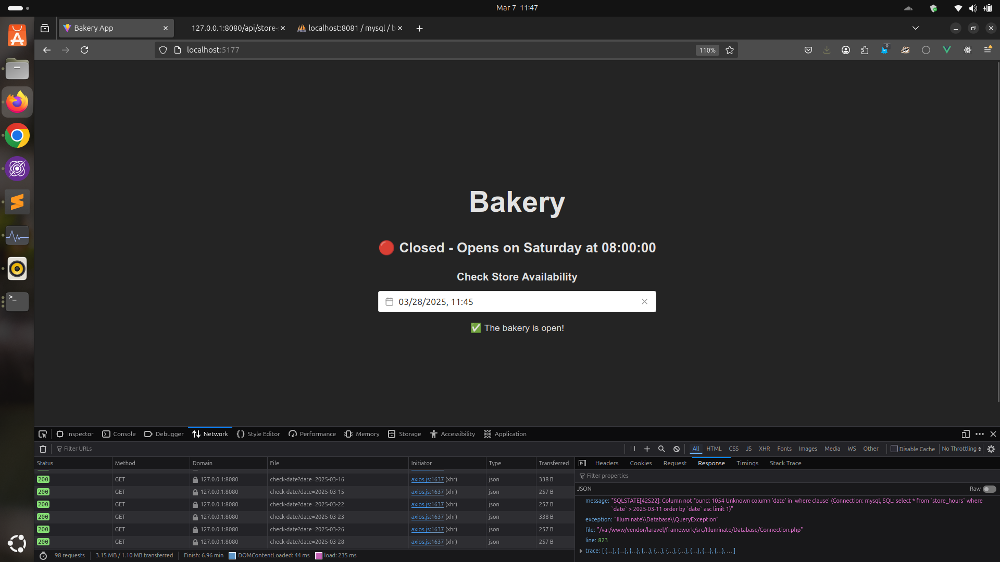

# **🍞 Bakery Store Status App**

A simple web application for managing bakery opening hours, checking store status in real-time, and allowing users to verify if the store is open on a selected date.

---

## **📌 Prerequisites**
Ensure you have the following installed on your system before proceeding:

✅ [Docker](https://www.docker.com/)
✅ [Node.js](https://nodejs.org/) (latest LTS recommended)
✅ npm (comes with Node.js)

---

## **🚀 Installation & Setup**

### **🔧 Backend (Laravel) Setup**
1. **Copy the `.env` file:**
```sh
cp backend/.env.example backend/.env
```

2. Build and start the Docker containers:
```
docker-compose up -d --build
```

3. Generate the application key:
```
docker-compose up -d --build
```

4. Run database migrations and seeders:
```
docker exec -it bakery-backend php artisan migrate --seed
```

5. Verify that the backend API is running:
Open your browser and visit:
👉 http://127.0.0.1:8080

6. Run automated tests to verify if all things are working
```
docker exec -it bakery-backend php artisan test
```

### **🎨 Frontend (Vue.js) Setup**

1. Navigate to the frontend directory:
```
cd frontend
```

2. Start the development server:
```
npm run dev
```

3. Access the frontend in your browser:
👉 http://localhost:5173 (or depending on the path that will be provided by Vite)

### **🐬 Database Management (phpMyAdmin)**

Open phpMyAdmin in your browser:
- 👉 http://127.0.0.1:8081

Login Credentials:
- Username: root
- Password: rootpassword
- Database Name: bakery_db

### **📸 Screenshots**

#### 📍 Store Status Widget


#### 📍 Date Picker Feature

